# Birthday-Email-Sender-Google-App-Scripts  

A simple Google Apps Script that sends automated birthday wishes via Gmail, using data stored in a Google Sheet.


[](https://ko-fi.com/Y8Y21JGEH6)

##  How to use ?
###  Step 1: Clone the repository
```bash
git clone https://github.com/agneay/Birthday-Email-Sender-Google-App-Scripts.git
``` 
### Step 2: Have a data sheet ready
Create a Google Sheet with the following columns:
- Name
- Email
- Birthday (in MM/DD/YYYY format) converted to date object in Google Sheets

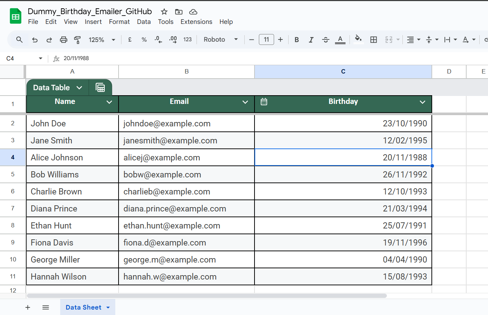

### Step 3: Must do - tweaking (for proper functionality)
- Ensure the three columns are named exactly as `Name`, `Email`, and `Birthday`.
- Select all the data (including headers) and click on `Format > Convert To Table` or alternatively you can use the shortcut `Ctrl + Alt + Shift + t`.
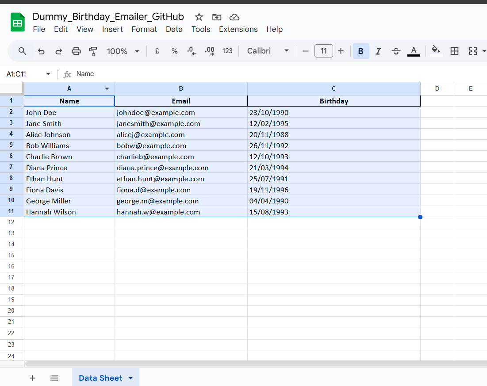
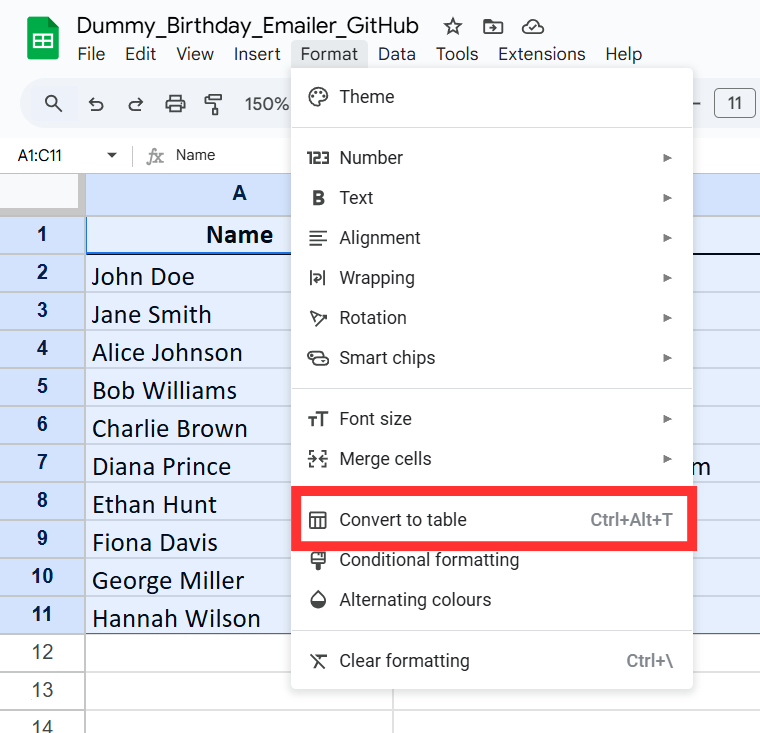
- Rename the table in the Google Sheet to `Data Table`
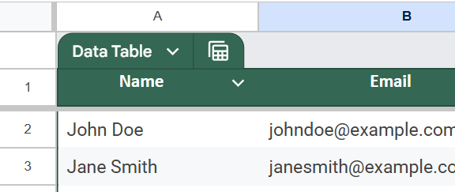
- Rename the sheet to `Data Sheet`


### Step 4: Set up the Google Apps Script
1. Open the Google Sheet you created.
2. Click on `Extensions > Apps Script`.


> NOTE: Extensions option will not be available if you are using a file imported from Excel, view troubleshooting section above to convert it to a Google Sheet.
3. Delete any code in the script editor and replace it with the code from `Code.js` file in this repository.
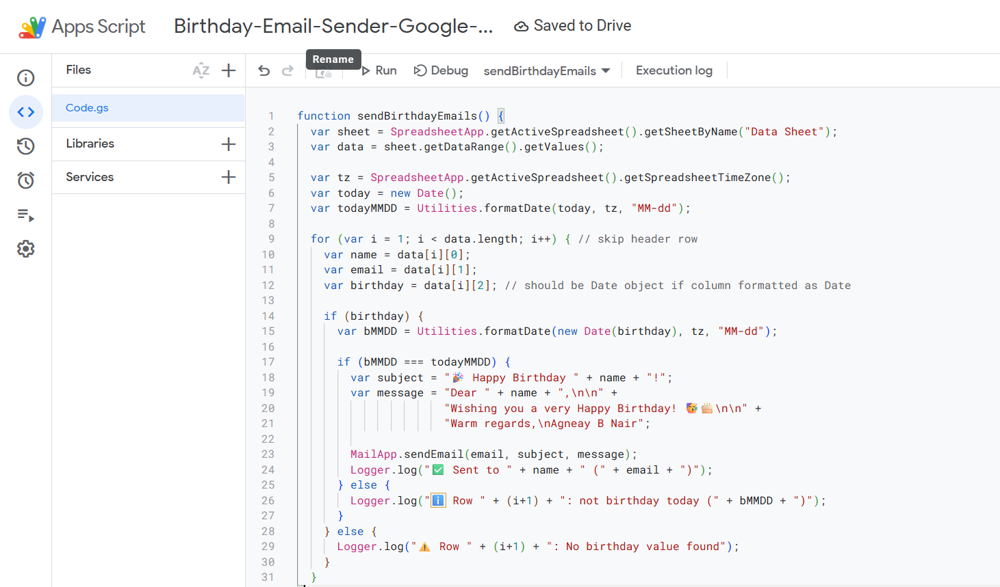
4. Save the script with a name like "BirthdayEmailSender".
5. Ensure the app Script is saved.

### Step 5: Customize the email message
1. In the Apps Script editor, locate the `sendBirthdayEmails` function.
2. Modify the email subject and body as desired. 
3. Subject and body can be customized in the following lines:
   ```javascript
   var subject = "Happy Birthday, " + name + "!";
   var body = "Dear " + name + ",\n\nWishing you a fantastic birthday filled with joy and surprises!\n\nBest wishes,\n[Your Name]";
   ```
4. Make sure to replace `[Your Name]` with your actual name or the name you want to appear in the email.
### Step 6: Set up the trigger
1. In the Apps Script editor, click on the clock icon (Triggers) in the left sidebar.

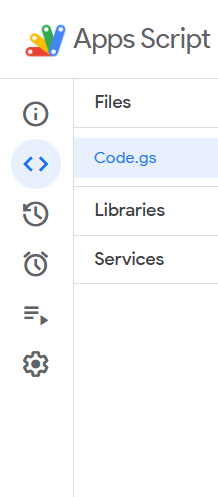

2. Click on `+ Add Trigger` in the bottom right corner.
3. Choose the following options:
   - Choose which function to run: `sendBirthdayEmails`
   - Choose which deployment should run: `Head`
   - Select event source: `Time-driven`
   - Select type of time based trigger: `Day timer`
   - Select time of day: Choose a time that works for you
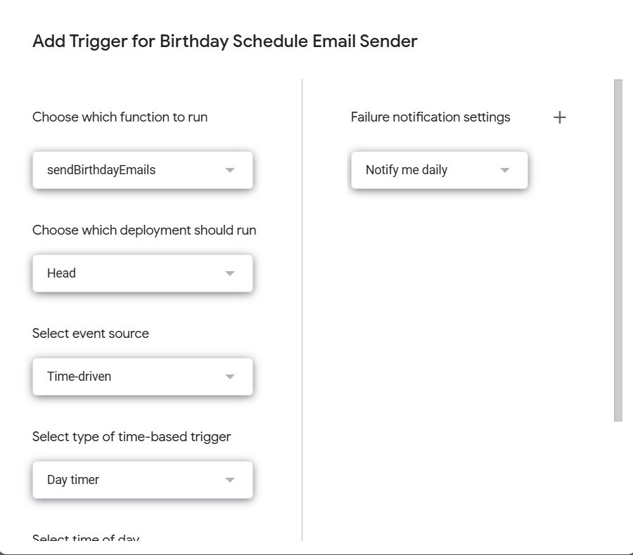

4. Click `Save`.

### Step 7: Authorize the script
1. The first time you run the script or set up a trigger, you will be prompted to authorize the script to access your Google account.
2. Click on `Review Permissions`.
3. Choose your Google account.
4. Click on `Allow` to grant the necessary permissions.

> NOTE: Incase of `Google has'nt Verified this app` error, refer to the troubleshooting section below.

### Troubleshooting
- If you encounter issues with date formats, ensure that the 'Birthday' column is set to the correct date format in Google Sheets.

To Change the date format:
1. Select the 'Birthday' column and click on the dropdown arrow next to the column letter and Select `Edit Column Type`

2. Choose `Date`
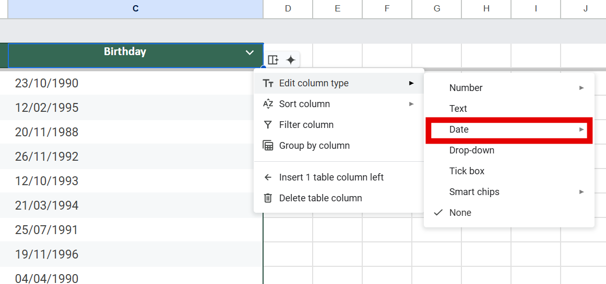
3. Choose `Date`
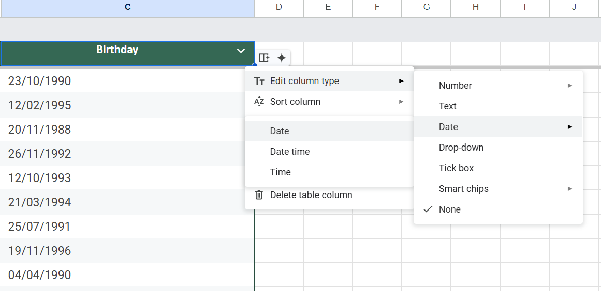


- Ensure that the email addresses in the 'Email' column are valid and correctly formatted.

- If you have imported a excel file file into Google Sheets, there will be a `.xlsx` near the name of the sheet. Convert it to a Google Sheet by clicking on `File > Save as Google Sheets`.
1. The sheet imported from excel will have a `.xlsx` near the name of the sheet.
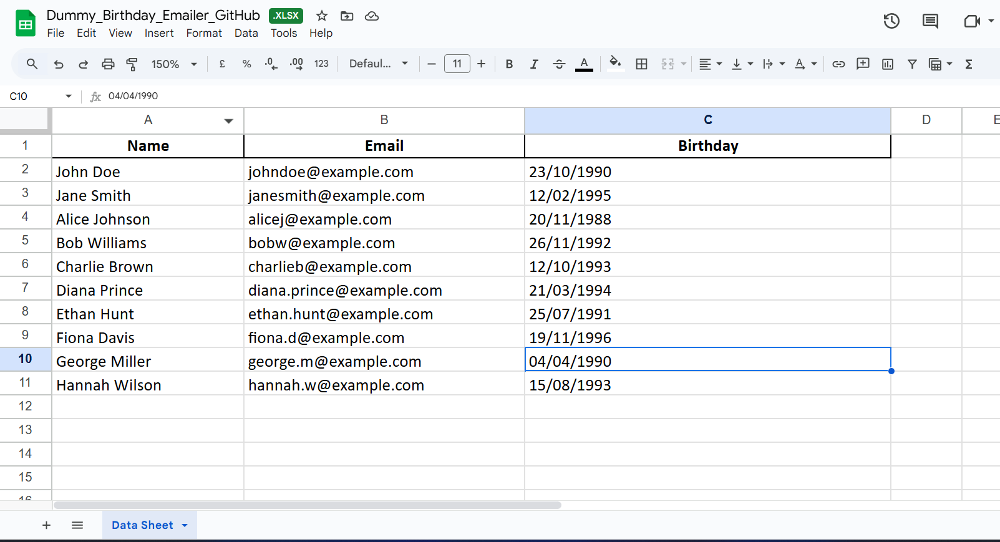
2. Click on `File > Save as Google Sheets` and work with the new Google Sheet created.
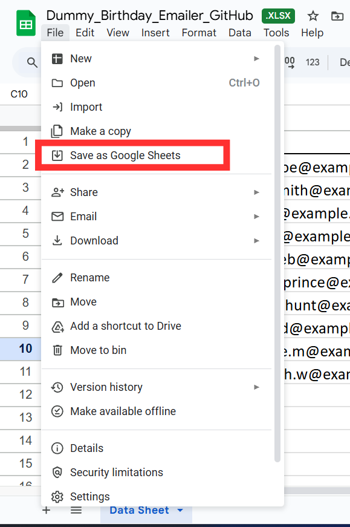

- Incase of `Google has'nt Verified this app` error, click on `Advanced` and then `Go to BirthdayEmailSender (unsafe)` to proceed.  

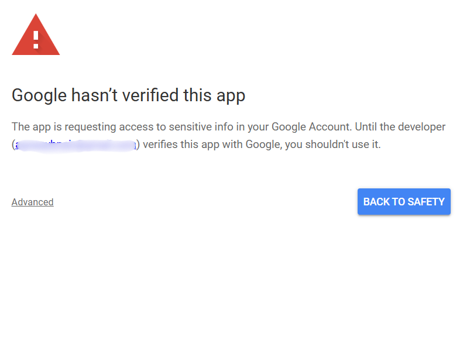
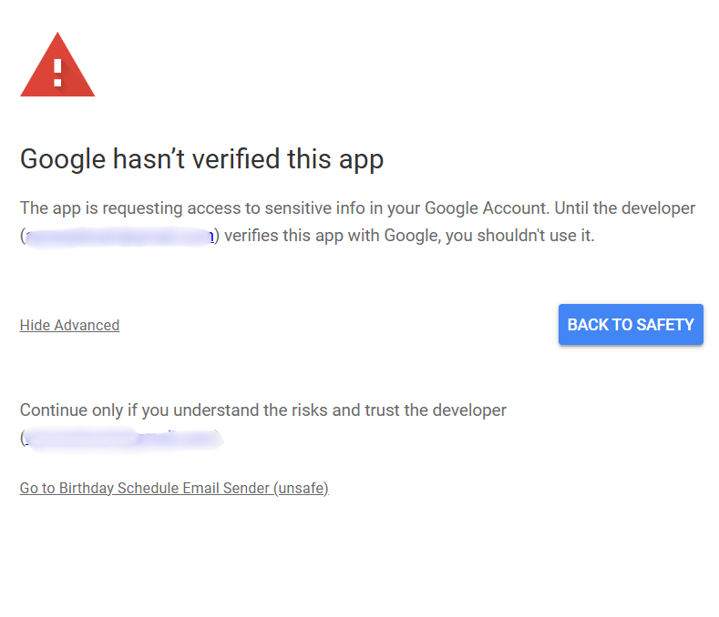

